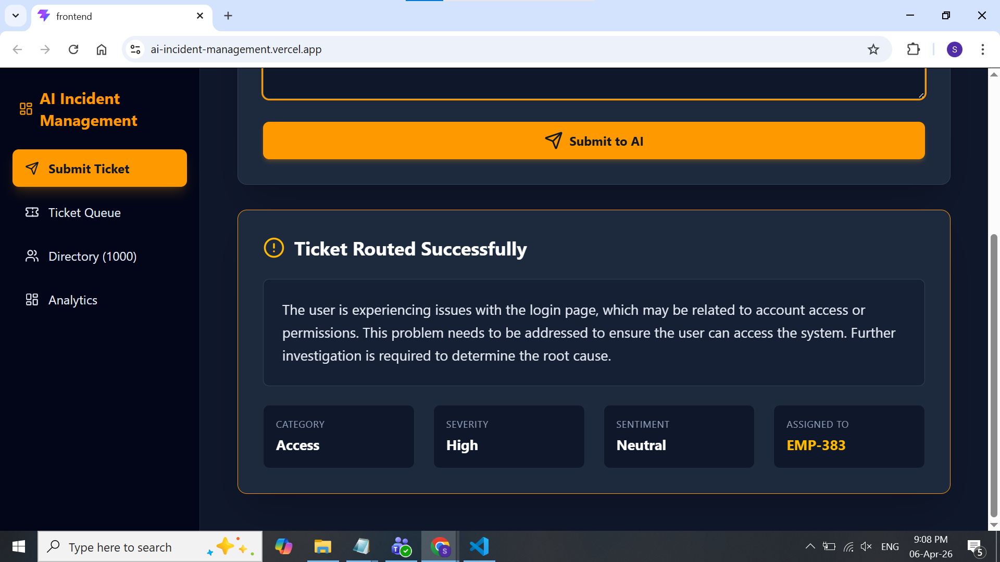
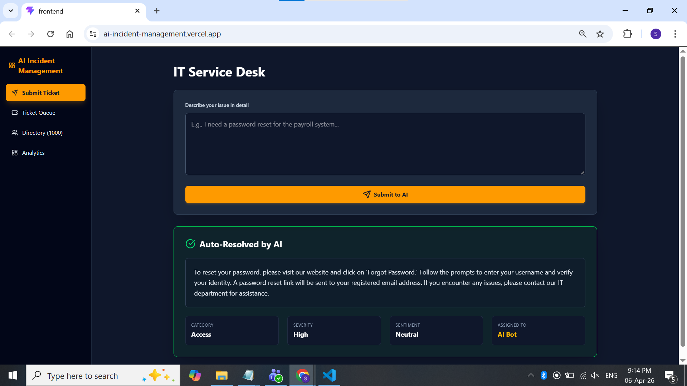
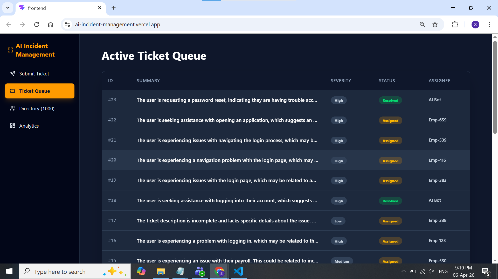
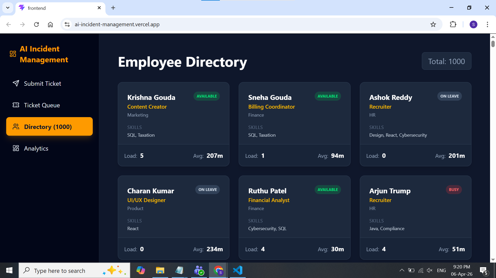
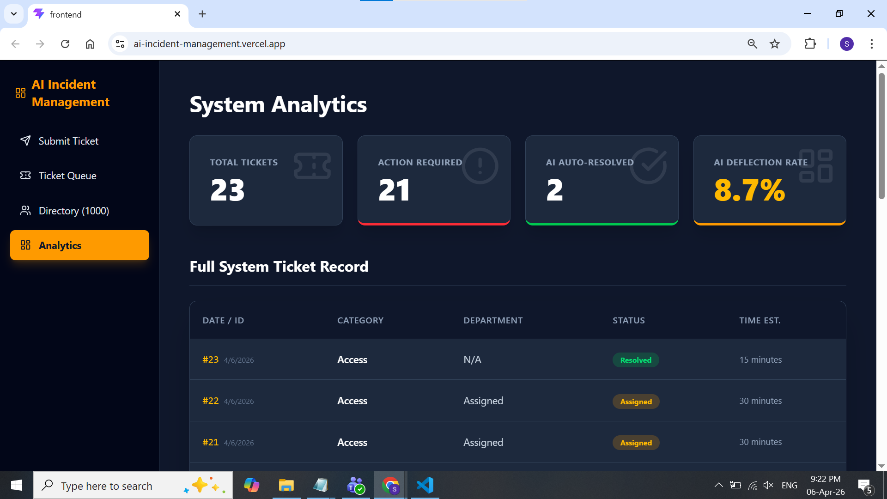

## Ticket Assigned To Concerned Employee

## Ticket Resoved by AI Itself

## Module Ticket Queue

## Employees Directory

## Analytics of Incidents

#Incident Management By AI

##  Project Overview
The **Incident Management By AI** platform is an enterprise-grade, full-stack ticketing system designed to automate IT service desk operations. By integrating an advanced Large Language Model (Llama 3.3 70B), the system acts as a Level 1 / Level 2 support agent—capable of reading incoming tickets, analyzing user sentiment, auto-resolving common queries, and intelligently routing complex issues to the correct department based on employee skills, availability, and active workload.

This project demonstrates a modern microservices architecture, combining a highly responsive React frontend with a scalable Python/FastAPI backend and an AI-driven engine.

##Tech Stack
**Frontend:**
* **React.js** (via Vite for lightning-fast HMR)
* **Tailwind CSS v4** (Modern utility-first styling with a premium dark/amber enterprise theme)
* **Lucide React** (Professional SVG icon library)

**Backend:**
* **Python 3** & **FastAPI** (High-performance API framework)
* **SQLite** & **SQLAlchemy** (Relational database and ORM)
* **Groq API** (Hosting the **Llama-3.3-70b-versatile** model for near-instant AI inference)

##Feature List (Core Modules)

* **Module 1: AI Incident Management & Intake**
    * Parses incoming unstructured text to extract: Category, Severity, Sentiment, and Estimated Resolution Time.
* **Module 2: Auto-Resolution Engine**
    * Deflects repetitive tickets (e.g., password resets, policy queries) by instantly generating contextual, helpful AI responses without human intervention.
* **Module 3: Intelligent Department Routing**
    * Strict routing matrix applies priority bumps (e.g., "Server Down" auto-escalates to Critical).
* **Module 4: Dynamic Employee Directory**
    * Manages 1,000+ simulated corporate employees.
    * Load-aware routing: AI assigns tickets based on an employee's specific department, availability status, and current active ticket load.
* **Module 5: Ticket Lifecycle Management**
    * Live queue tracking ticket status (New, Assigned, Resolved, Closed).
    * Sortable and visually categorized by severity and status.
* **Module 6: Analytics Dashboard**
    * Real-time calculation of total volume, open action items, AI-resolved tickets, and total system deflection rate.

---

## Setup & Installation Instructions

## Prerequisites
* Node.js (v18 or higher)
* Python (3.10 or higher)
* A free API key from [Groq](https://console.groq.com/)

## 1. Backend Setup (FastAPI)
1. Navigate to the backend directory:
   bash
   cd backend
2. python -m venv venv
# Windows:
venv\Scripts\activate
# Mac/Linux:
source venv/bin/activate
3. pip install fastapi uvicorn sqlalchemy pydantic groq
4. python seed_large_db.py
5. uvicorn main:app --reload
##Frontend SetUp
cd frontend
## Node dependencies

npm install
npm install lucide-react
npm install tailwindcss @tailwindcss/vite

## Vite Development Server

npm run dev
The frontend will now run on http://localhost:5173